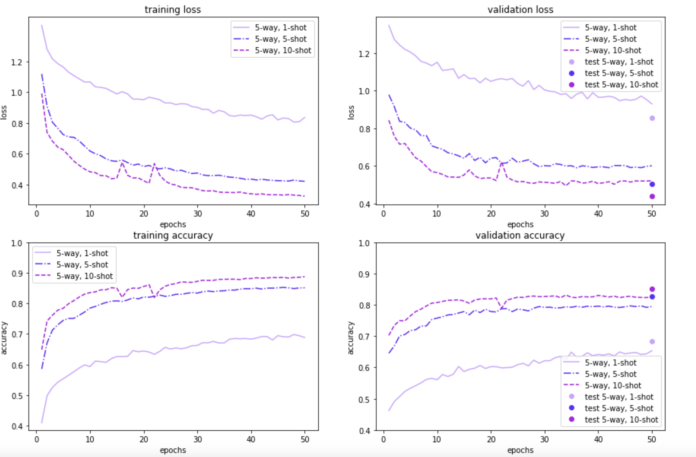
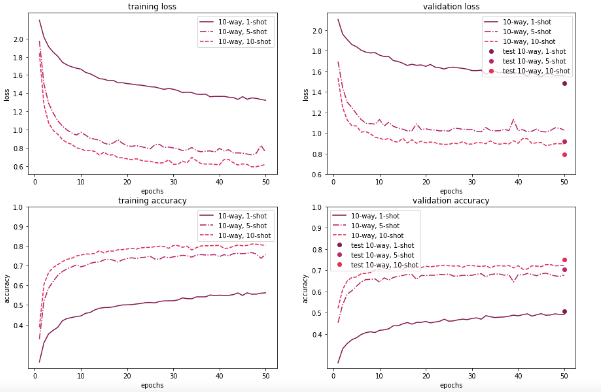

# Meta-learning: Learning to learn

This repo accompanies the code from our [report](ff15.fastforwardlabs.com) discussed in the Experiment section

## Setup environment

Step 1: Install from Torchmeta from source

    ```
    git clone https://github.com/nishamuktewar/pytorch-meta.git
    conda create --name meta_env python=3.7 ipykernel
    conda activate meta_env
    cd pytorch-meta
    pip install -e .
    ```
Step 2: Install other libraries

    ```
    conda install -c anaconda scikit-learn
    ```

## Repo structure

## Run experiments

### Meta-training

- Run the following command to train a meta-learning model on the meta-training dataset. Note that this step will take a few hours if run for the first time and that is because it downloads the entire [Quick Draw!](https://quickdraw.withgoogle.com/data) dataset and transforms it into train/validation/test meta-datasets to be consumed during training and evaluation.

```
python train.py /storage/smb79ck2/ndata/ \
    --use-cuda \
    --num-training-samples 20 \
    --num-ways 5 \
    --num-shots 5 \
    --num-shots-test 5 \
    --num-steps 5 \
    --hidden-size 20 \
    --batch-size 10 \
    --num-batches 100 \
    --num-epochs 10 \
    --step-size 0.01 \
    --meta-lr 0.001 &
```
- The configuration, model and result files are saved in the ./models folder using the date-timestamp as the foldername


### Meta-inference

- Test the meta learning model
```
python test.py ./models/<<date-timestamp>>/config.json
```

### Results






## References

Leveraged source code from the following repos:

> Tristan Deleu, Tobias Würfl, Mandana Samiei, Joseph Paul Cohen, and Yoshua Bengio. Torchmeta: A Meta-Learning library for PyTorch, 2019 [[ArXiv](https://arxiv.org/abs/1909.06576)]

```
@misc{deleu2019torchmeta,
  title={{Torchmeta: A Meta-Learning library for PyTorch}},
  author={Deleu, Tristan and W\"urfl, Tobias and Samiei, Mandana and Cohen, Joseph Paul and Bengio, Yoshua},
  year={2019},
  url={https://arxiv.org/abs/1909.06576},
  note={Available at: https://github.com/tristandeleu/pytorch-meta, https://github.com/tristandeleu/pytorch-maml}
}
```

> Chelsea Finn, Pieter Abbeel, and Sergey Levine. Model-agnostic meta-learning for fast adaptation of deep networks. International Conference on Machine Learning (ICML), 2017 [ArXiv]

```
@article{finn17maml,
  author={Chelsea Finn and Pieter Abbeel and Sergey Levine},
  title={Model-{A}gnostic {M}eta-{L}earning for {F}ast {A}daptation of {D}eep {N}etworks},
  journal={International Conference on Machine Learning (ICML)},
  year={2017},
  url={http://arxiv.org/abs/1703.03400},
  note={Available at: }
}
```